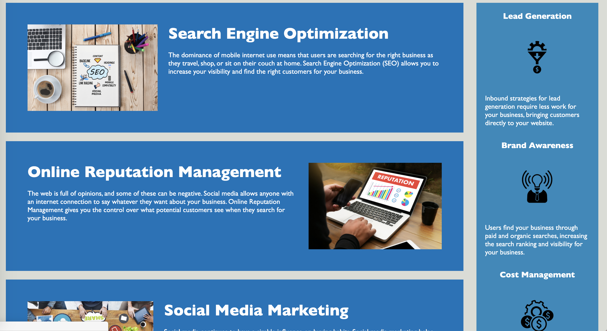

# 01-Challenge-Horiseon

In Challenge 01, I focused on taking an existing webpage and refractoriing its coding to specifically target web accessibility. I made the page DRY by cleaning the repitition in the code and making it concise for future changes to be done without difficulties. The need that Horiseon wanted fulfilled as a marketing agency was to have an accessible standard of codebase that would be optimized for search engines effectively.

Below are the images of the accessible website made for Horiseon:

Here is the URL to access the image directly:
<a href="https://gracetalks.github.io/01-Challenge-Horiseon/">Visit Horiseon!</a>